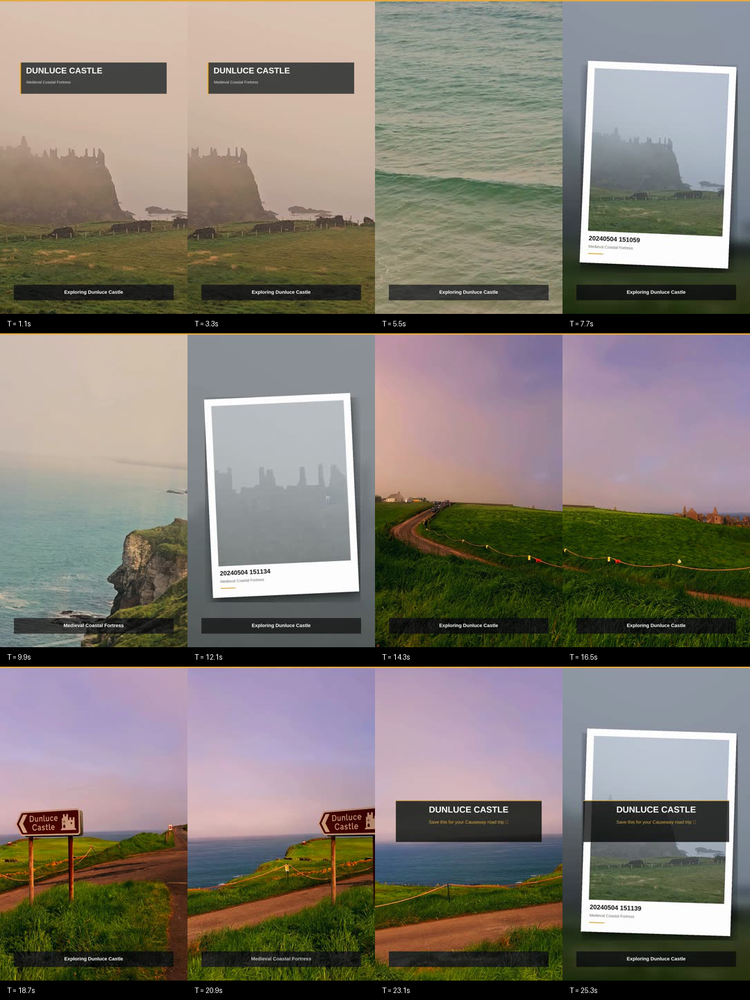
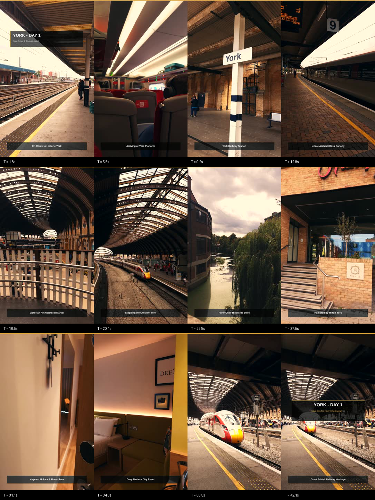

# 🎬 Videofy

> **Production-Grade Automated Video Editing & Templating Engine**  
> Build viral social reels (9:16) and cinematic widescreen films (16:9) with AI beat-sync, dynamic smart-cropping, 3D LUT color grading, kinetic motion graphics, and multi-vendor GPU acceleration.

[](https://github.com/Tamoghna12/videofy/actions/workflows/ci.yml)
[](https://www.python.org/)
[](https://ffmpeg.org/)
[](#-multi-vendor-gpu-hardware-acceleration)
[](LICENSE)

---

## 📸 Visual Showcase

| 9:16 Instagram Catchy Reel | 9:16 York Heritage Travel Reel |
| :---: | :---: |
|  |  |

---

## 🌟 Highlights

- ⚡ **1-Click Video Production**: Turn raw footage folders into polished, social-ready reels and widescreen films without manual timeline editing.
- 🚀 **Multi-Vendor GPU Acceleration**: Native hardware encoding for **NVIDIA NVENC** (`h264_nvenc`), **Intel Arc & Core Ultra Quick Sync** (`h264_qsv` / `h264_vaapi`), and **Apple Silicon** (`h264_videotoolbox`) with automatic CPU fallback.
- 🎵 **AI Beat-Drop Synchronization**: Analyzes audio transients and rhythm downbeats to snap video cuts, photo card reveals, and shutter flashes directly to musical beat drops.
- 🎯 **AI Smart Cropping & Auto-Framing**: Detects faces and visual saliency via OpenCV to dynamically pan the 9:16 crop window across 16:9 footage, ensuring subjects are always centered.
- 🎨 **250+ Curated 3D LUTs**: Universal `.cube` grading profiles including legendary Hollywood print stocks (*Kodak 2383, Fujifilm 3513DI*), Golden Hour warmth, Teal & Orange, and camera Log profiles (*Sony S-Log3, DJI D-Log, Panasonic V-Log, ARRI LogC*).
- 📸 **Dynamic Polaroid Motion Graphics**: Generates realistic Polaroid photo cards with auto EXIF orientation correction, dynamic tilt angles, drop shadows, 0.14s white shutter flashes, and ambient blurred background drift.
- 📊 **Kinetic Overlays & Typography**: Smooth animated gold progress bars, glassmorphism title badges, dynamic lower-third location pills, and outro call-to-action cards.
- 🎧 **Broadcast Audio Mastering**: Enforces strict **EBU R128** loudness normalization (**-16 LUFS** for reels, **-14 LUFS** for landscape) with automated background music ducking under ambient field audio.
- 🔍 **Automated Visual QC**: Generates high-resolution multi-frame visual contact sheets for instant visual inspection.

---

## 🚀 Quick Start

### 1. Prerequisites

Ensure **FFmpeg** and **Python 3.9+** are installed:

```bash
# Ubuntu / Debian
sudo apt update && sudo apt install -y ffmpeg fonts-liberation

# macOS
brew install ffmpeg

# Install Python requirements
pip install -r requirements.txt
```

### 2. Check System Hardware Acceleration

Check your active GPU encoder and supported hardware:

```bash
python3 render_template.py --info
```

Example output:
```text
⚡ System & Hardware Acceleration Status:
======================================================================
  Active Encoder     : h264_nvenc (NVENC)
  Available Encoders :
    • h264_nvenc (NVIDIA)                 : ✅ YES
    • h264_qsv (Intel Arc / QuickSync)    : ❌ NO
    • h264_videotoolbox (Apple Silicon)   : ❌ NO
    • h264_vaapi (Linux VAAPI)            : ❌ NO
    • libx264 (Universal CPU)             : ✅ YES
======================================================================
```

### 3. Inspect Available Presets & 3D LUTs

```bash
# List all built-in video presets
python3 render_template.py --list-presets

# List all 250+ available 3D LUTs
python3 render_template.py --list-luts
```

### 4. 1-Click Rendering Commands

```bash
# Render an Instagram Catchy Reel with AI Beat-Sync & GPU Acceleration
python3 render_template.py \
  --preset insta_catchy_reel \
  --footage "path/to/raw_footage" \
  --title "DUNLUCE CASTLE" \
  --subtitle "Medieval Coastal Fortress" \
  --duration 35 \
  --music "happy_summer.mp3" \
  --lut "CINECOLOR_GOLDEN_HOUR.CUBE" \
  --accel auto \
  --beat-sync \
  --smart-crop \
  --output "edit/dunluce_castle_reel.mp4" \
  --qc "edit/verify/qc_dunluce.png"

# Render a 16:9 Widescreen Film (Kodak 2383 Print Stock & Orchestral Crescendo)
python3 render_template.py \
  --preset cinematic_landscape \
  --footage "path/to/landscape_footage" \
  --title "GIANT’S CAUSEWAY" \
  --subtitle "Wonders of the Antrim Coast" \
  --lut "Rec709 Kodak 2383 D65.cube" \
  --music "experience_einaudi.mp3" \
  --output "edit/causeway_cinematic.mp4"

# Render a Lifestyle Vlog (Warm culinary tone curve & chill acoustic reset)
python3 render_template.py \
  --preset lifestyle_vlog \
  --footage "path/to/vlog_footage" \
  --title "BRADFORD EVENING" \
  --subtitle "Curry Capital Dining & City Stroll" \
  --grade "culinary_warm" \
  --music "debussy_clair_de_lune.mp3" \
  --output "edit/bradford_lifestyle.mp4"

# Render a Fast Cuts Short (15–20s rapid-fire TikTok / Shorts micro-reel)
python3 render_template.py \
  --preset fast_cuts_short \
  --footage "path/to/footage" \
  --title "YORK QUICK" \
  --subtitle "15 Seconds of Heritage" \
  --music "memory_reboot.mp3" \
  --duration 18 \
  --output "edit/york_short.mp4"
```

---

## ⚡ Multi-Vendor GPU Hardware Acceleration

Videofy automatically detects your system's hardware configuration and routes encoding to the optimal hardware encoder:

| GPU / Platform | Encoder | CLI Flag | Benefits |
| :--- | :--- | :--- | :--- |
| **NVIDIA GeForce / RTX** | `h264_nvenc` | `--accel nvenc` | 5&times;–10&times; faster encoding, low CPU overhead |
| **Intel Arc / Core Ultra** | `h264_qsv` / `h264_vaapi` | `--accel qsv` or `--accel vaapi` | Dedicated Quick Sync hardware, extreme 1080p/4K throughput |
| **Apple Silicon (M1–M4)** | `h264_videotoolbox` | `--accel videotoolbox` | Native Apple Media Engine hardware encoding |
| **AMD Radeon** | `h264_vaapi` | `--accel vaapi` | Linux kernel VAAPI hardware encoding |
| **Universal Fallback** | `libx264` | `--accel cpu` | Runs anywhere with standard CPU threads |

*By default, `--accel auto` selects the fastest available hardware encoder automatically.*

---

## 🎵 AI Beat-Drop Synchronization

Using audio transient analysis and spectral flux onset detection, the `--beat-sync` flag aligns your timeline with the music:
- Computes rhythmic BPM and energy transients.
- Nudges clip cut points and photo card inserts so transitions snap directly to the downbeats.
- Synchronizes the 0.14s white camera shutter flash with snare and kick transients.

---

## 🎯 AI Smart Cropping & Subject Auto-Framing

When converting 16:9 landscape video into 9:16 vertical reels, static center cropping often cuts off subjects on the edges. The `--smart-crop` engine:
- Scans video frames for faces and visual saliency via OpenCV.
- Dynamically centers the crop window around the active focal point.
- Applies a temporal smoothing filter so camera movement feels like an intentional, smooth cinematic pan.

---

## 📦 Preset Catalog

| Preset | Aspect Ratio | Target Duration | Visual Design & Motion Graphics | Sound & Grading |
| :--- | :---: | :---: | :--- | :--- |
| **`insta_catchy_reel`** | 9:16 (1080&times;1920) | 25–45s | Interwoven Polaroid photo cards, EXIF auto-rotation, 0.14s white shutter flashes, animated gold progress bar, frosted glass cards | Upbeat music (`solas` / `summer_pop`), ambient waves ducking, EBU R128 (-16 LUFS) |
| **`cinematic_landscape`** | 16:9 (1920&times;1080) | 45–90s | Widescreen landscape, slow Ken Burns push-in, subtle bottom title pills, outro CTA card | Print film emulation (Kodak 2383 D65), orchestral crescendo (`experience_einaudi`) |
| **`lifestyle_vlog`** | 9:16 (1080&times;1920) | 30–60s | Warm culinary curve, relaxed pacing, minimal typography, travel journal aesthetics | Chill piano / lo-fi (`debussy_clair_de_lune`), gentle wind |
| **`fast_cuts_short`** | 9:16 (1080&times;1920) | 15–20s | Rapid-fire cuts (1.6–2.0s), punchy typography, high retention hook | Synthwave / beat drops (`memory_reboot`) |

---

## 🏗️ Architecture & Modules

```
videofy/
├── render_template.py        # Unified CLI command runner
├── requirements.txt          # Python dependencies (Pillow, numpy, scipy, librosa, opencv)
├── CONTRIBUTING.md           # Contributor guide and preset development manual
├── README.md                 # Project documentation
├── .github/workflows/ci.yml  # GitHub Actions automated CI testing workflow
├── docs/images/              # Embedded sample contact sheets and demo visuals
├── video_templates/          # Core templating engine package
│   ├── __init__.py           # Package exports & version
│   ├── mcp_bridge.py         # MCP tool connectors (kinocut/claudeclip) & stream validation
│   ├── core/
│   │   ├── accel.py          # Multi-vendor GPU hardware acceleration (NVENC, QSV, VideoToolbox, VAAPI)
│   │   ├── beat_sync.py      # AI musical downbeat & transient detection
│   │   ├── smart_crop.py     # AI subject & face tracking for 16:9 -> 9:16 reframing
│   │   ├── conformer.py      # Video conforming, aspect-ratio smart crop & Ken Burns drift
│   │   ├── polaroids.py      # Polaroid generation with EXIF transpose & motion cards
│   │   ├── grading.py        # Universal 3D LUT resolver + calibrated tone curves
│   │   ├── overlays.py       # Kinetic typography, progress bars, lower-thirds & outro CTAs
│   │   ├── audio.py          # EBU R128 mastering (-16 LUFS) & multi-track ducking
│   │   └── qc.py             # Multi-frame visual contact sheet generator
│   └── presets/
│       ├── insta_catchy_reel.py   # 9:16 Catchy Instagram reel preset
│       ├── cinematic_landscape.py # 16:9 Cinematic widescreen preset
│       ├── lifestyle_vlog.py      # 9:16 Cozy lifestyle vlog preset
│       └── fast_cuts_short.py     # 9:16 Fast cuts TikTok/Shorts preset
├── assets/
│   ├── luts/                 # 250+ curated 3D .cube LUT profiles
│   └── ambient_sfx/          # Atmospheric field recordings
└── bg_music/                 # Curated soundtrack library (classical, lofi, upbeat)
```

---

## 🎨 Creative Grading & 3D LUTs

Over 250 industry-standard 3D `.cube` LUTs are organized under `assets/luts/`:
- **Film Emulation**: `Rec709 Kodak 2383 D65.cube`, `Fujifilm 3513DI`, `Filmic Resolve`
- **Creative Travel**: `CINECOLOR_GOLDEN_HOUR.CUBE`, `Summer_Vibes`, `Teal_and_Orange`
- **Calibrated Built-In Curves**:
  - `summer_vibrant`: S-curve boost with +14% saturation and lifted midtones.
  - `culinary_warm`: Warm gamma lift and gentle contrast for food & interiors.
  - `clean_landscape`: High clarity, preserved natural blues and greens.
  - `moody_contrast`: Crushed blacks and desaturated highlights for dramatic tones.

---

## 🧩 Adding a Custom Preset

Adding a new preset takes 3 simple steps:
1. Create `video_templates/presets/my_custom_preset.py` implementing `def render(footage_dir, output_file, ...):`.
2. Register it in `video_templates/presets/__init__.py`.
3. The preset becomes immediately executable via `python3 render_template.py --preset my_custom_preset`.

See [CONTRIBUTING.md](CONTRIBUTING.md) for full developer documentation.

---

## 📜 License

MIT License. See [LICENSE](LICENSE) for details.
